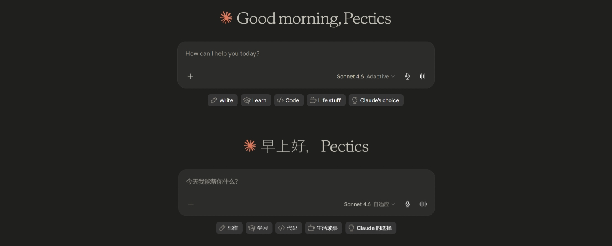
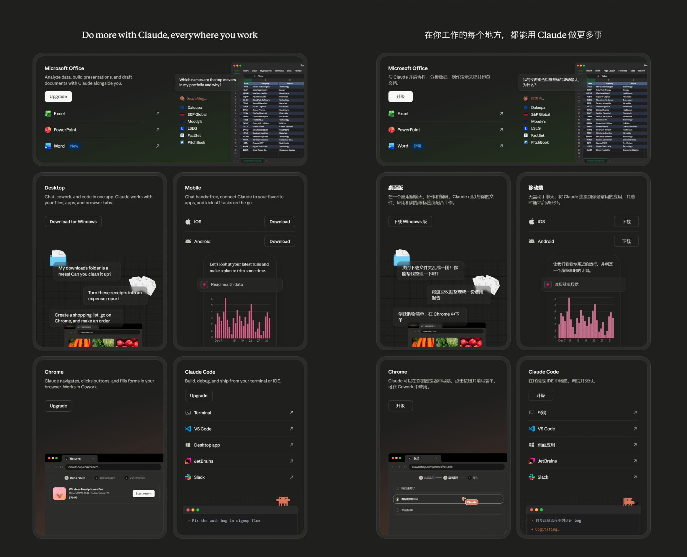
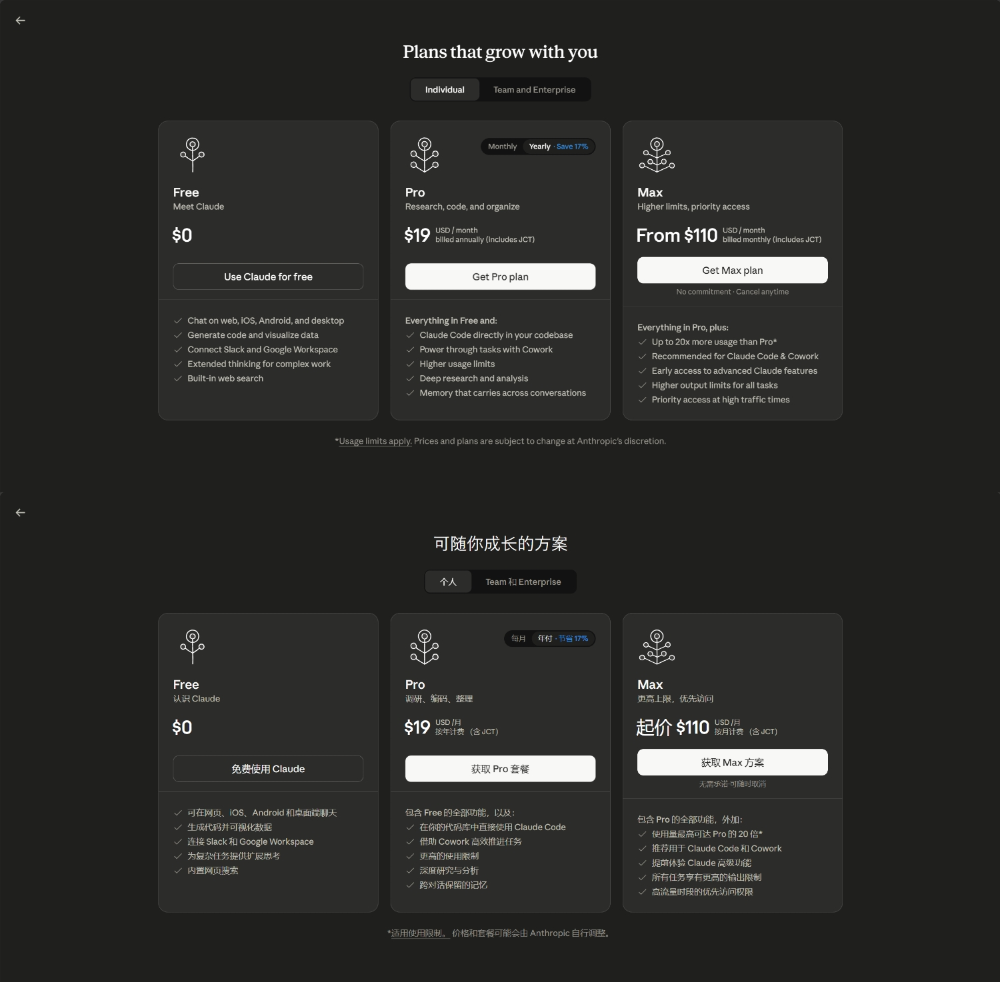

<div align="center">


# Claude i18n

**給 Claude.ai 加上一個並不存在的語言。**

[简体中文](README.md) | 繁體中文 | [English](README.en.md)

[](https://github.com/pectics/claude-web-i18n/releases)
[](LICENSE)
[](#安裝)
[](#支援的語言)

</div>

---

## 它能做什麼？

Claude 官方至今不支援簡體中文介面。**這個擴充功能解決了這個問題。**

安裝後，Claude Web 的語言選單裡會出現 **中文（中国）** 選項。點一下，超過 15,000 條 UI 與 Statsig 文字瞬間切換為中文。不需要代理，不需要設定，不需要等 Anthropic 哪天心情好了才支援。

<div align="center">



<details>
<summary>點擊查看更多截圖</summary>


</details>

</div>

---

## 安裝

### 方式一：應用程式商店安裝（推薦）

> ⚡ 30 秒搞定，無需任何技術知識

- Chrome Web Store：
  [Claude i18n](https://chromewebstore.google.com/detail/claude-i18n/fkfmbjccelbeolkoekeaegajhhdndajj)
- Microsoft Edge Add-ons：
  [Claude i18n](https://microsoftedge.microsoft.com/addons/detail/claude-i18n/meogggfdmdeigjpkcpkdhngaegpncgjc)

### 方式二：Tampermonkey 使用者腳本（實驗性）

> 🧪 面向 Firefox Desktop + Tampermonkey 的實驗性版本

非 Chromium 系列瀏覽器使用者可以試用 [`userscript/claude-i18n.user.js`](userscript/claude-i18n.user.js)。這個版本仍處於實驗階段，暫不承諾 Safari、Violentmonkey、Greasemonkey 相容。

1. 在 Firefox Desktop 安裝 Tampermonkey
2. 開啟 Tampermonkey Dashboard，建立新腳本
3. 用 [`userscript/claude-i18n.user.js`](userscript/claude-i18n.user.js) 的內容取代預設範本並儲存
4. 開啟 [claude.ai](https://claude.ai)，點擊左下角使用者名稱 → 語言 → **中文（中国）** ✓

詳細說明見 [`userscript/README.md`](userscript/README.md)。

### 方式三：從 Releases 下載

1. 前往 [Releases 頁面](https://github.com/Pectics/claude-i18n/releases)，下載最新版本的 `.crx` 檔案
2. 開啟 Chrome / Edge，進入 `chrome://extensions/`
3. 開啟右上角的 **開發人員模式**
4. 將下載的 `.crx` 檔案**直接拖進**瀏覽器視窗
5. 點擊「新增擴充功能」確認安裝
6. 開啟 [claude.ai](https://claude.ai)，點擊左下角使用者名稱 → 語言 → **中文（中国）** ✓

### 方式四：從原始碼建置

```bash
git clone https://github.com/Pectics/claude-i18n.git
cd claude-i18n
```

然後在 `chrome://extensions/` 中開啟**開發人員模式**，選擇「載入未封裝項目」，選取專案的 `extension/` 目錄。

---

## 它是怎麼運作的？

Claude 的後端介面仍然不接受 `zh-CN` 這種擴充 locale。這個擴充功能會在前端模擬支援 `zh-CN`，把只有後端會處理的部分統一回退成 `en-US`，再在瀏覽器端把語言狀態與語言包替換回擴充 locale。

```
你點擊「中文」
        ↓
`hook.js` 在 `document_start` + `MAIN` world 提前注入
        ↓
Claude Web 建立官方語言陣列時，擴充功能會把遠端 `locales.json` 裡的擴充語言追加進去
        ↓
`PUT` / `GET /api/account_profile`、`bootstrap`、`experience` 等請求會在需要時回退成 `en-US`
        ↓
命中擴充語言的 `GET /i18n/*.json` 與 `/i18n/statsig/*.json` 會交給擴充功能後台處理
        ↓
後台會先查本地快取，再用 `/version/{locale}.json` 的 hash 判斷是否需要更新
        ↓
回傳 zh-CN 主語言包與 Statsig 語言包
        ↓
UI 依照 Claude 自己的語言流程切換為中文
```

目前的實作分成三層：

- `hook.js`：執行於頁面主世界，負責 Array 代理、`fetch` 攔截，以及 `account_profile` / `bootstrap` / `experience` / `i18n` 這些關鍵請求的改寫。
- `script.js`：負責頁面與擴充功能後台之間的橋接通訊。
- `service.js`：負責存取遠端 Vercel 站點、讀取 `/locales.json` 與 `/version/{locale}.json`，並維護本地快取。

**快取策略：**

- 擴充語言列表：先讀 `localStorage` 中快取的 `locales.json`，再 lazy load 遠端版本；只有版本或內容變化時才替換本地快取。
- 語言檔版本資訊：存放在 `chrome.storage.local`，以 locale 為鍵記錄最近一次 `/version/{locale}.json` 的 hash。
- 語言檔正文：存放在 `Cache Storage`，只有 hash 變化時才重新下載對應的 `*.json` / `*.statsig.json`。
- `/i18n/*.overrides.json`：目前直接由擴充功能回傳空物件 `{}`。

---

## 支援的語言

| 語言 | 條目數量 | 狀態 |
|------|----------|------|
| 簡體中文 (zh-CN) | 15,058 條（主語言包 15,012 + Statsig 46） | ✅ 可用 |
| 更多語言 | — | 歡迎貢獻 |

---

## 參與貢獻

### 改進翻譯

主介面翻譯檔位於 [`zh-CN/zh-CN.json`](zh-CN/zh-CN.json)。如果是 `gated_messages` / Statsig 相關文案，請編輯 [`zh-CN/zh-CN.statsig.json`](zh-CN/zh-CN.statsig.json)。

原文主包對照在 [`.original/en-US.json`](.original/en-US.json)。

直接編輯 JSON 檔案送出 PR 即可，結構非常簡單：

```json
{
  "some.ui.key": "對應的中文翻譯"
}
```

### 新增語言

1. 在 [`locales.json`](locales.json) 的 `locales` 陣列中追加 locale 字串（如 `"zh-TW"`）
2. 建立對應目錄與兩個翻譯檔案：
   `zh-TW/zh-TW.json`
   `zh-TW/zh-TW.statsig.json`
3. 執行 `./build.sh`，確認會產生：
   `dist/locales.json`
   `dist/zh-TW/version.json`
4. 送出 PR

### 本地建置

```bash
# 建置給 Vercel 部署用的語言包發佈檔案
./build.sh
```

`build.sh` 會自動：

- 複製語言目錄到 `dist/`
- 產生發布用的 `dist/locales.json`
- 為每個 locale 產生 `dist/<locale>/version.json`
- 分別計算主語言包與 Statsig 語言包的 hash，供擴充功能做 lazy cache 更新

---

## 更新日誌

### 1.1.0

- 將執行鏈路重構為 `hook.js`、`script.js`、`service.js` 三層，分別負責頁面攔截、橋接通訊與後台快取
- 擴充 locale 的後端請求統一回退為 `en-US`，並在 `account_profile`、`bootstrap/app_start` 等回應中恢復為擴充 locale
- 擴充語言列表改為從遠端 `/locales.json` lazy load，並快取到 `localStorage`
- 語言包更新改為透過 `/version/{locale}.json` 做 hash 校驗，版本資訊存 `chrome.storage.local`，正文存 `Cache Storage`
- 補齊 `experiences/claude_web`、`/i18n/*.overrides.json` 與目前擴充 locale 請求流程的相容處理

### 1.0.2

- 跟進 Claude Web 最近的前端邏輯更新，恢復自訂語言切換能力
- 調整 page hook 注入方式，避免 runtime i18n store 因時序問題捕獲失敗
- 相容新版 `gated-messages` 請求鏈路，防止切換到擴充語言時被 404 HTML 回應中斷
- 增加壞快取自清理邏輯，舊的無效 HTML 回應不會再長期污染語言包快取

### 1.0.1

- 前端逆向成功，打通 Claude Web 執行時語言覆寫入口
- 語言切換改為無需重新整理即可即時生效，整體體驗更順暢
- 選單注入、執行時切換、語言包攔截與本機快取鏈路正式閉環

### 1.0.0

- 初始 MVP 版本發佈
- 在 Claude Web 語言選單中注入簡體中文入口
- 提供基礎中文語言包發佈、請求攔截與瀏覽器端載入能力

---

## 常見問題

**切換語言後沒有效果？** \
確認擴充功能已啟用，然後重新整理 claude.ai 頁面。

**會影響我的 Claude 帳號嗎？** \
不會。擴充功能只在瀏覽器端運作，不修改任何帳號設定或與 Anthropic 伺服器互動（除了正常的語言包拉取）。

**切換回英文還能正常使用嗎？** \
完全沒問題。在語言選單選擇任意官方支援的語言，擴充功能會自動退出中文模式。

**語言包會自動更新嗎？** \
會。擴充功能透過版本雜湊偵測遠端更新，有新版本時自動下載最新語言包。

---

## 授權

[MIT](LICENSE) © 2026 [Pectics](https://github.com/Pectics)

---

<div align="center">

如果這個擴充功能幫到了你，可以請我喝杯咖啡 ☕ \
或者……點個 ⭐，也是莫大的支持。

[![愛發電](https://img.shields.io/badge/愛發電-Pectics-946ce6?style=flat-square&logo=data:image/svg+xml;base64,PHN2ZyB3aWR0aD0iMTAwIiBoZWlnaHQ9IjEwMCIgdmlld0JveD0iMTUgMjUgMTMwIDExMCIgeG1sbnM9Imh0dHA6Ly93d3cudzMub3JnLzIwMDAvc3ZnIj48cGF0aCBmaWxsLXJ1bGU9ImV2ZW5vZGQiIGNsaXAtcnVsZT0iZXZlbm9kZCIgZD0iTTY1IDkwLjdjLTEuNiAwLTIuOCAxLjMtMi44IDIuOCAwIDEuNiAxLjMgMi44IDIuOCAyLjhzMi44LTEuMyAyLjgtMi44YzAtMS42LTEuMy0yLjgtMi44LTIuOFoiIGZpbGw9IndoaXRlIi8+PHBhdGggZmlsbC1ydWxlPSJldmVub2RkIiBjbGlwLXJ1bGU9ImV2ZW5vZGQiIGQ9Ik05MS44IDk5LjJjMS42IDAgMi44IDEuMyAyLjggMi44IDAgMS42LTEuMyAyLjgtMi44IDIuOC0xLjYgMC0yLjgtMS4zLTIuOC0yLjggMC0xLjYgMS4zLTIuOCAyLjgtMi44WiIgZmlsbD0id2hpdGUiLz48cGF0aCBmaWxsLXJ1bGU9ImV2ZW5vZGQiIGNsaXAtcnVsZT0iZXZlbm9kZCIgZD0iTTEzNC42IDk4LjRjMi41IDEuNSA2LjUgNC4xIDUuMSA4LjctLjUgMS43LTEuNyAzLjEtMy40IDQtMCAwLS4xLjEtLjEuMS0yLjIgMS4xLTUuMSAxLjItNy43LjMtLjgtLjMtMS42LS41LTIuNS0uOC0uNi0uMi0xLjItLjQtMS44LS42LTEuOSAzLjEtNS44IDYuNS0xMS4zIDkuNC05LjkgNS4yLTI0LjggOC42LTQyIDQuOC0xMy4yLTIuOS0yMS45LTguMy0yNS44LTE2LTMuMS02LjEtMi40LTEyLjMtLjgtMTYuMSAxLjUtMy4xIDUuNy03LjEgMTAuOS0xMS4zLTEuMy0xLjUtMi41LTMuNC0yLjQtNS4zIDAtMS42LjgtMi45IDIuMi0zLjggMy41LTIuNCA4LjItLjUgMTEuMSAxLjIgMS43LTEuMSAzLjMtMi4zIDQuOS0zLjMtMS4xLS40LTIuNy0uOC00LjctMS03LS43LTI1LjMtNC0zMS43LTYuOEMxOC45IDU1LjMgMTkuMSA0Ny44IDIwLjcgNDMuOWMyLjgtNi45IDE4LjEtMTEgMjUuMS0xMC44IDMuNC4xIDUuNCAxLjEgNi4xIDMuMSAxLjMgMy40LTIuNiA1LjMtNy43IDcuNy0xLjMuNi0yLjggMS40LTQuMyAyLjEgNy4xLjYgMTcuNy4yIDI1LjYtLjEgNi44LS4zIDEzLjItLjUgMTguNy0uNCAxOS4xLjQgMzQuMiA4LjQgNDQuNiAyMy43IDYuOCAxMCA0LjggMjAuMSAxLjcgMjcuOSAxLjQuMSAyLjcuNSA0IDEuNFpNNjEgNzYuNmMtMS4xLS40LTIuMi0uNi0yLjgtLjUuMi40LjcgMSAxLjIgMS42LjUtLjQgMS0uOCAxLjYtMS4yWm03Mi44IDI5LjhjLjUtLjMuNy0uNS44LS45LjItLjYtLjctMS4zLTIuNi0yLjQtMS40LS45LTIuOS0xLTUuMi0uNi0uMSAwLS4yIDAtLjMgMC0uMSAwLS4xIDAtLjIgMC0zLjUuMy02LjItMi45LTYuOC0zLjYtLjktMS4yLS43LTIuOC40LTMuOCAxLjEtLjkgMi44LS43IDMuOC40LjMuNC44LjggMS4yIDEuMSAzLjQtNy40IDUuNS0xNS45LS40LTI0LjUtOS42LTE0LjEtMjIuOC0yMS00MC40LTIxLjQtNS4zLS4xLTExLjcuMS0xOC40LjQtMTUuNi42LTI2LjcuOS0zMi45LTEuMS0uMS0wLS4xLS4xLS4yLS4xLTEuOC0uNi0zLjItMS4zLTQuMi0yLjMtMS0xLjEtMS0yLjguMS0zLjggMS4xLTEuMSAyLjgtMSAzLjguMS4xLjEuMy4yLjUuMyAyLjQtMi4xIDUuOS0zLjggOS4xLTUuNC4zLS4yLjctLjMgMS4xLS41LTIuNy4zLTYuMyAxLjEtMTAgMi41LTQuNyAxLjgtNi45IDMuNy03LjMgNC45LTIgNSA3IDkuNSAxMSAxMS4yIDUuNSAyLjQgMjIuNyA1LjYgMzAuMSA2LjQgNC43LjUgNy42IDEuOSA5LjMgMyA1LTMuMiA4LjktNS41IDEwLjEtNi4yIDEuMi0uOCAyLjktLjMgMy42LjlzLjMgMi45LS45IDMuN2MtMTQuMyA4LjQtMzYuNyAyMy4zLTM5LjggMjkuNy0xLjEgMi41LTEuNiA3IC43IDExLjUgMy4xIDYuMSAxMC44IDEwLjcgMjIuMiAxMy4yIDI1LjMgNS41IDQzLjItNS43IDQ3LjMtMTEuNC0uNC0uMy0uOC0uNy0xLjEtMS0uOS0xLjItLjctMi45LjUtMy43IDEuMi0uOSAyLjktLjcgMy43LjUuNS43IDMuNCAxLjUgNSAyIC45LjMgMS44LjYgMi43LjkgMS4zLjQgMi42LjQgMy42LS4xWiIgZmlsbD0id2hpdGUiLz48L3N2Zz4=)](https://afdian.com/a/pectics)
[](https://paypal.me/Pectics)

| 微信讚賞 | 支付寶 |
|:---:|:---:|
|  |  |
</div>
